# Oddtide · New Rod Lineup (ArtRevision `new1`)

Ten original rods for Bellwether Cay: 1 starter, 3 tier 2, 3 tier 3 and 3 tier-4 rods built to be clipped.
Each one is a weapon or artifact that happens to fish, with its own silhouette and one neon accent color.

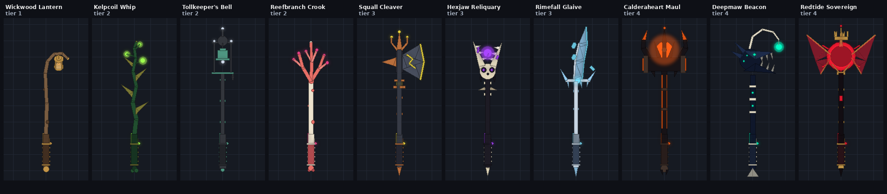

> The previews are flat-shaded renders I made offline from the builder's exact part data, not Roblox screenshots.
> They're accurate for shape, proportion and color. Real lighting, Neon bloom, Glass, ForceField and particles
> will look richer in Studio.

| # | Rod | Id | Tier | Accent | Suggested price |
|---|-----|----|------|--------|-----------------|
| 1 | Wickwood Lantern | `wickwood_lantern` | 1 | Amber | Free (starter) |
| 2 | Kelpcoil Whip | `kelpcoil_whip` | 2 | Lime | 7,500 |
| 3 | Tollkeeper's Bell | `tollkeepers_bell` | 2 | Ghost white | 12,000 |
| 4 | Reefbranch Crook | `reefbranch_crook` | 2 | Hot pink | 10,000 |
| 5 | Squall Cleaver | `squall_cleaver` | 3 | Storm yellow | 85,000 |
| 6 | Hexjaw Reliquary | `hexjaw_reliquary` | 3 | Hex purple | 120,000 |
| 7 | Rimefall Glaive | `rimefall_glaive` | 3 | Ice cyan | 100,000 |
| 8 | Calderaheart Maul | `calderaheart_maul` | 4 | Lava orange | 750,000 |
| 9 | Deepmaw Beacon | `deepmaw_beacon` | 4 | Abyss teal | 900,000 |
| 10 | Redtide Sovereign | `redtide_sovereign` | 4 | Blood red | 1,500,000 |

Perks and prices are starting points; balance them however you like.

---

## Effects every rod shares (driven by `RodFX.lua`)

Each rod has its own particle looks and colors (listed per rod below), but every rod reacts to each moment the same way:

| Moment | What happens |
|---|---|
| **Idle** | `Idle*` emitters run. Neon accent parts pulse using the rod's waveform (sine, flicker or heartbeat). Floating parts spin, bob or sway. `GlowLight` breathes with the pulse. |
| **Equip** | The glow ramps up from 15% to full over about 0.6 s with a flash, `Equip*` bursts, and the idle loop starts. |
| **Charge** (0–1) | The glow climbs to 190%, `Charge*` emitters ramp up with the charge, and every moving piece speeds up to 2.2×. |
| **Cast** | `CastBurst` fires at the Tip, `CastTrail` streaks for 0.9 s, the glow flashes and moving pieces get a kick. |
| **Bite** | `BiteFlare` and `BiteSparks` fire at the Tip, the glow flares, moving pieces kick to 2.2×, and the rod shakes in the hand for 0.45 s (no shake with reduced motion). |
| **Reel** | The glow holds at 170%, `Reel*` emitters run, the `ReelFlow` beam streams up the shaft, and animation runs at 1.8×. |
| **Catch** | Every `Catch*` emitter bursts, scaled by rarity (common 1× up to secret/divine 3.1×). `FlashLight` flashes, the glow spikes and moving pieces kick to 3×. Tier 4 adds **two expanding shockwave rings**. |

**Reduced motion** keeps 40% of the particles, halves the floating and spinning, and turns off the shake.

---

## 1 · Wickwood Lantern

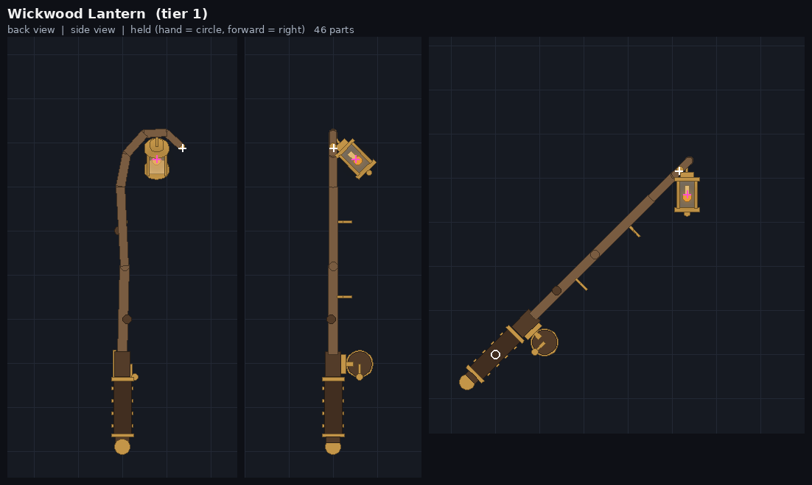

- **Id / tier:** `wickwood_lantern` · Tier 1
- **Theme:** The lighthouse.
- **Story:** The old lighthouse keeper's walking crook. The lantern has never once gone out.
- **Suggested perk:** +10% XP from every catch. **Price:** Free (starter).
- **Hero piece:** A bent driftwood shepherd's crook with a brass ship's lantern hanging from the curve. The lantern is pre-angled so it hangs straight down while held, and swings gently side to side.
- **Palette:** Driftwood `122, 92, 66` · Dark wood `84, 60, 42` · Brass `196, 150, 72` · **Neon amber `255, 170, 60`** (flame tongue `255, 214, 140`)
- **Materials:** Wood, Metal, Glass (lantern pane), Neon (flame), Leather (grip)
- **Detail:** Leather grip with brass wraps, brass reel on a wooden spool, two brass line guides, wood knots, and a brass pommel ball.
- **Effects:**
  - Idle: `IdleEmbers` drift up from the flame. The flame flickers (flicker wave, 1 Hz, ±25%). The lantern sways ±0.12 rad.
  - Equip: amber sparks burst.
  - Charge: swirling sparks.
  - Cast: a spark burst at the crook tip, plus an amber trail.
  - Bite: the tip flares.
  - Reel: embers pour off the lantern, plus the amber flow beam.
  - Catch: a 38-particle amber burst scaled by rarity, a single flare and a lantern flash.

## 2 · Kelpcoil Whip

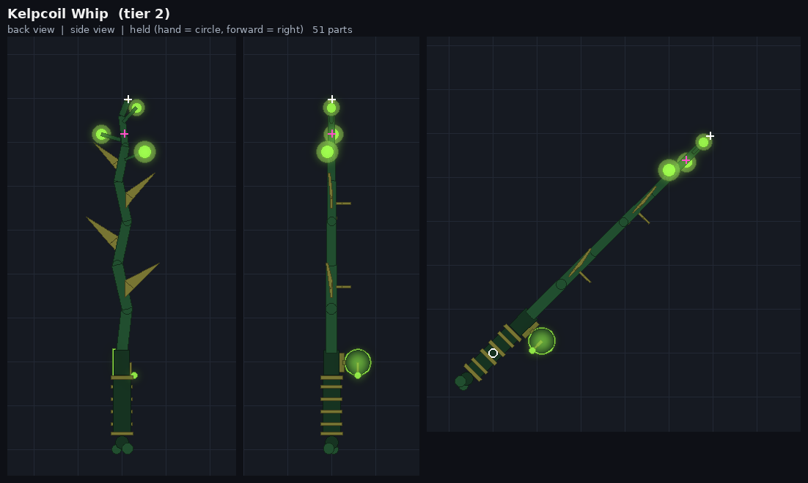

- **Id / tier:** `kelpcoil_whip` · Tier 2
- **Theme:** The kelp forest.
- **Story:** Cut from the forest's oldest stalk, it still sways with tides that aren't there.
- **Suggested perk:** +15% luck in the Kelp Forest. **Price:** 7,500.
- **Hero piece:** A living S-curved kelp stalk with three translucent float bladders near the top, each holding a glowing core. Pointed frond blades ripple along the stalk and it ends in a curled frond tip.
- **Palette:** Kelp `34, 78, 48` · Deep kelp `22, 52, 34` · Olive `120, 118, 52` · **Neon lime `160, 255, 80`**
- **Materials:** Rubber (stalk and grip), Glass (bladders), Neon (cores and reel rim), SmoothPlastic (fronds)
- **Detail:** Rubber grip with olive wraps, a glowing reel rim, two guides, and a holdfast-root pommel.
- **Effects:**
  - Idle: `IdleBubbles` rise and `IdleMotes` drift. The bladders bob out of step, the fronds ripple, and the cores glow in turn (sine, 0.9 Hz).
  - Equip: a lime burst.
  - Charge: a swirl.
  - Cast: a burst and a lime trail.
  - Bite: a flare.
  - Reel: a stream of bubbles, plus the flow beam.
  - Catch: a bubble-green burst and flash.

## 3 · Tollkeeper's Bell

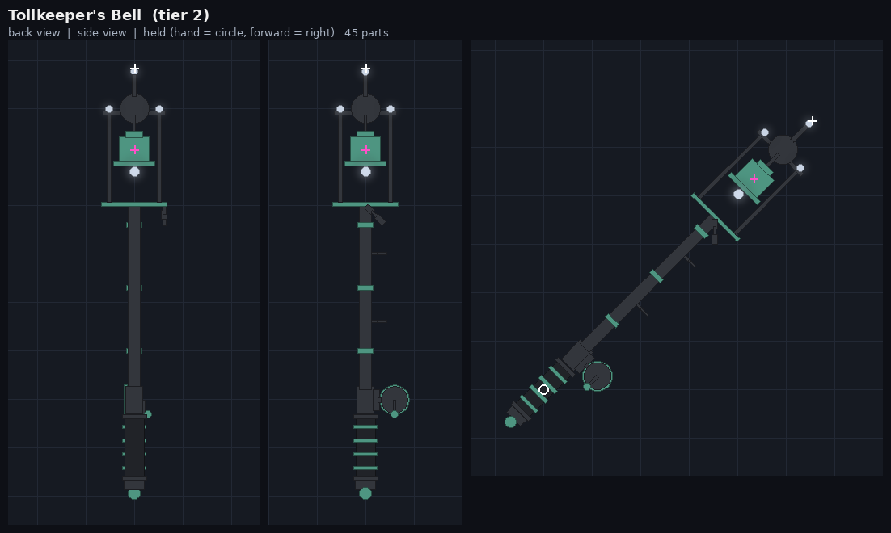

- **Id / tier:** `tollkeepers_bell` · Tier 2
- **Theme:** The bell buoy over the dropoff.
- **Story:** When fog swallows the Cay, the bell buoy rings, and everything below it listens.
- **Suggested perk:** Bites 20% faster in fog; Ghostly mutation slightly more likely. **Price:** 12,000.
- **Hero piece:** An open iron buoy cage on a corroded buoy pole. A verdigris bell swings inside like a pendulum, a ghost-white clapper glows, there are four lamps on the cage corners and a beacon lamp on the finial, and a short chain hangs from the cage floor.
- **Palette:** Iron `52, 54, 60` · Dark iron `34, 35, 40` · Verdigris `78, 150, 130` · **Neon ghost white `225, 238, 255`**
- **Materials:** CorrodedMetal, Metal, Neon, Fabric (grip)
- **Detail:** Fabric grip with verdigris wraps, a corroded reel, banded pole, and a counterweight pommel.
- **Effects:**
  - Idle: `IdleMist` curls around the cage and `IdleMotes` drift. The bell swings ±0.2 rad, the corner lamps alternate, and **a faint ring of light pulses out every 3.5 s**.
  - Equip: a white burst.
  - Charge: a swirl.
  - Cast: a burst and a white trail.
  - Bite: a flare.
  - Reel: motes, plus the flow beam.
  - Catch: a spark burst and **one bright "toll" ring** (7 studs).

## 4 · Reefbranch Crook

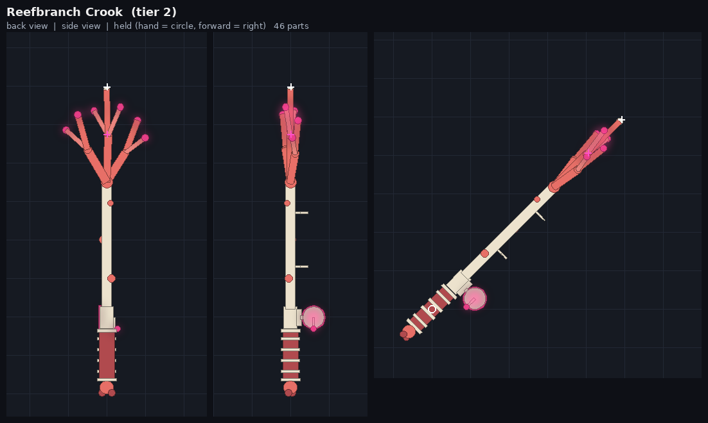

- **Id / tier:** `reefbranch_crook` · Tier 2
- **Theme:** The coral shelves.
- **Story:** Bleached coral that kept growing after it was pulled from the shelf.
- **Suggested perk:** +15% coins from fish caught on the Coral Shelves. **Price:** 10,000.
- **Hero piece:** A crown of branching coral antlers (three main branches with side forks, offset in depth) tipped with six glowing polyps. The shaft is bleached bone with barnacles on it.
- **Palette:** Bone `236, 226, 206` · Coral `232, 112, 104` · Dark coral `176, 74, 78` · **Neon hot pink `255, 70, 150`**
- **Materials:** Marble (bone), SmoothPlastic (coral), Pebble (barnacles and knot), Neon, Fabric (grip)
- **Detail:** Coral-red grip with bone wraps, a bone reel with a glowing rim, two guides, and a coral-knot pommel.
- **Effects:**
  - Idle: `IdlePlankton` motes and faint `IdleSpores`. **The polyps pulse one after another** around the crown (sine, 0.6 Hz, ±50%).
  - Equip: a pink burst.
  - Charge: a swirl.
  - Cast: a burst and a pink trail.
  - Bite: a flare.
  - Reel: motes, plus the flow beam.
  - Catch: a puff of pink spores and petals, with a flash.

## 5 · Squall Cleaver

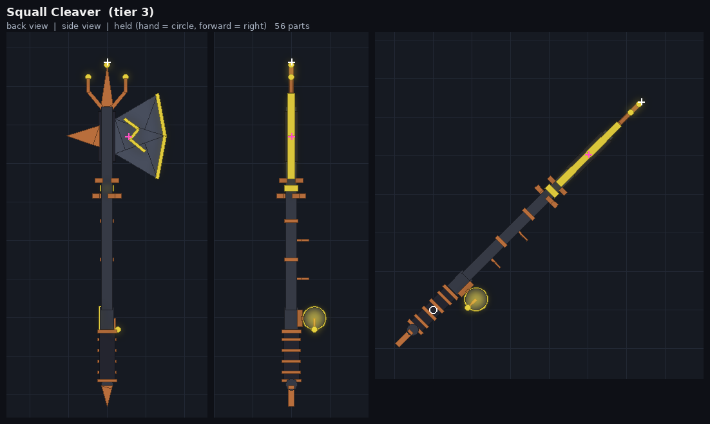

- **Id / tier:** `squall_cleaver` · Tier 3
- **Theme:** Storms and the Electric mutation.
- **Story:** Hammered from the copper of a ship struck nine times in one squall.
- **Suggested perk:** +25% luck during storms; Electric mutation more likely. **Price:** 85,000.
- **Hero piece:** A huge crescent slate axe head with a neon storm edge and a zig-zag lightning inlay, a copper back spike, and a three-pronged copper top **with lightning crackling between the prongs**. Below the head sits a tesla coil: two copper rings counter-rotating around a glowing core.
- **Palette:** Storm slate `54, 58, 70` · Blade slate `72, 78, 94` · Copper `184, 110, 60` · **Neon storm yellow `255, 232, 70`**
- **Materials:** Slate, Metal (copper), Neon, Leather (grip)
- **Detail:** Leather grip with copper wraps, a slate reel with a glowing rim, two guides, and a copper spike pommel.
- **Effects:**
  - Idle: `IdleSparks` crackle from the head and `IdleCrackle` from the spear tip. The `IdleArcLeft` and `IdleArcRight` lightning beams flicker and re-curve every 0.04–0.12 s. The coil rings spin at ±2.2 rad/s, and the neon flickers like a failing bulb (1.5 Hz).
  - Equip: a spark burst.
  - Charge: the sparks build and the arcs grow more violent.
  - Cast: a spark burst and a yellow trail.
  - Bite: a flare and sparks.
  - Reel: sparks, plus the flow beam.
  - Catch: a burst, a white spark shower (`CatchSparks`), and a flash.

## 6 · Hexjaw Reliquary

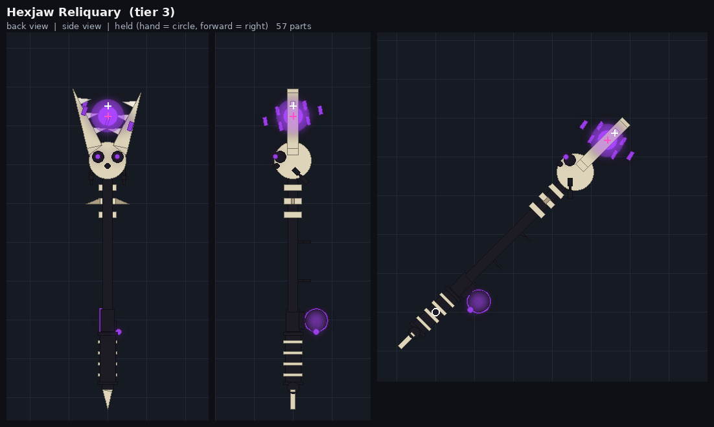

- **Id / tier:** `hexjaw_reliquary` · Tier 3
- **Theme:** Night, curses and the Hexed mutation.
- **Story:** Pulled up from the dropoff with its jaws still snapping. The orb inside whispers bargains.
- **Hero piece:** An eel skull staring back at the angler, with dark eye sockets, glowing purple pupils and jaws gaping upward lined with fangs. A hexed orb floats between the jaws inside a shimmering ForceField shell, circled by a tilted ring of six runes. Chains hang from the skull and there's a vertebrae neck below it. **The fishing line comes out of the orb.**
- **Suggested perk:** +20% luck at night; Hexed mutation more likely. **Price:** 120,000.
- **Palette:** Bone `222, 212, 186` · Dark bone `170, 158, 132` · Black `30, 28, 36` · **Neon hex purple `170, 70, 255`**
- **Materials:** Marble (bone), Slate, Metal (chains), ForceField (orb shell), Neon, Leather (grip)
- **Detail:** Black grip with bone wraps, a black reel with a glowing rim, two guides, and a bone-spike pommel.
- **Effects:**
  - Idle: purple `IdleSmoke` and `IdleMotes`. The orb and shell bob, the runes orbit on a tilted axis at 1 rad/s, and the chains sway (sine, 0.45 Hz, ±40%).
  - Equip: a purple burst.
  - Charge: a swirl.
  - Cast: a burst and a purple trail.
  - Bite: a flare.
  - Reel: smoke, plus the flow beam.
  - Catch: **the light is sucked inward first** (`CatchImplode` rushes into the shell), then 0.3 s later the burst and flare explode outward.

## 7 · Rimefall Glaive

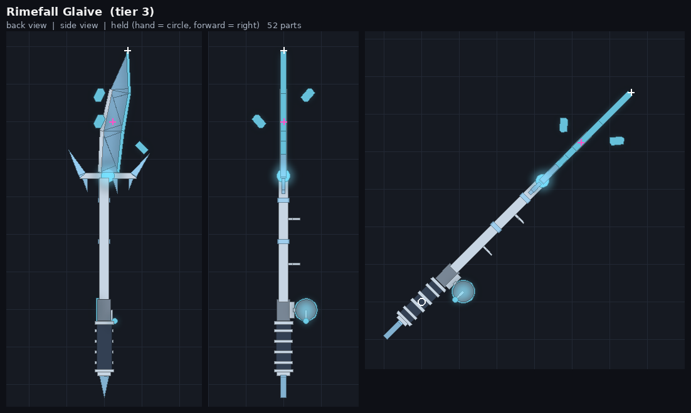

- **Id / tier:** `rimefall_glaive` · Tier 3
- **Theme:** The waterfall pool and the Frozen mutation.
- **Story:** Carved from the waterfall the winter it froze mid-fall.
- **Suggested perk:** +25% luck at the Waterfall Pool; Frozen mutation more likely. **Price:** 100,000.
- **Hero piece:** A long, curved, single-edged ice blade with a glowing frost edge and a silver spine. It sits over a silver crossguard with ice crystals and a frozen gem, with icicles hanging below, and three frost crystals orbit the blade.
- **Palette:** Frost silver `200, 214, 228` · Dark silver `120, 134, 150` · Glacier ice `150, 205, 240` · **Neon ice cyan `120, 225, 255`**
- **Materials:** Ice, Foil (silver), Neon, Fabric (grip)
- **Detail:** Fabric grip with silver wraps, a silver reel with a glowing rim, two guides, ice bands on the shaft, and an ice-spike pommel.
- **Effects:**
  - Idle: `IdleSnow` falls off the blade and `IdleGlint` motes drift. The crystals orbit at 0.7 rad/s and bob (calm sine, 0.35 Hz).
  - Equip: an ice burst.
  - Charge: frost swirls.
  - Cast: a burst and a long icy trail.
  - Bite: a flare.
  - Reel: frost, plus the flow beam.
  - Catch: **ice shards shatter outward and fall** (`CatchBurst` uses the shards look), plus a white `CatchMist` puff and a cold flash.

## 8 · Calderaheart Maul

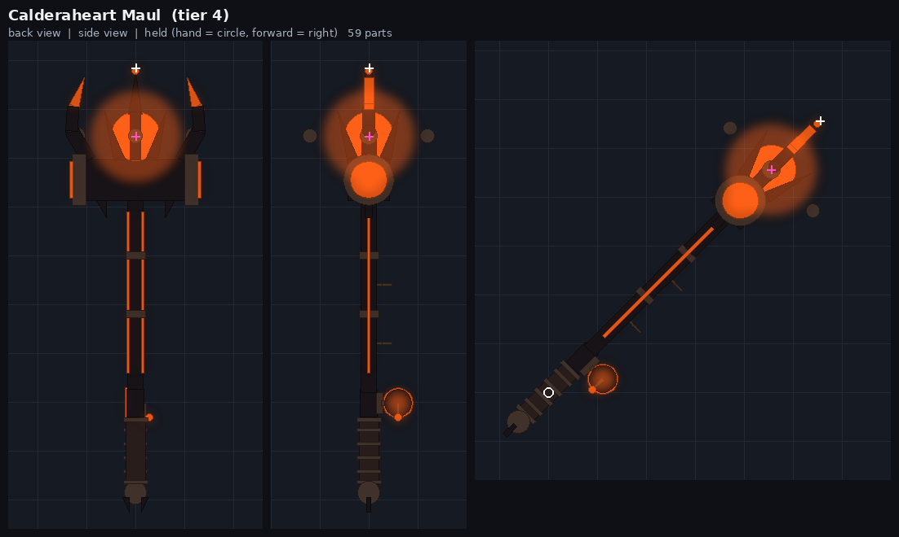

- **Id / tier:** `calderaheart_maul` · Tier 4
- **Theme:** The volcano, the lava crater and the Molten mutation.
- **Story:** The volcano's heart, chiselled out of the crater and still beating.
- **Suggested perk:** +40% luck in the Lava Crater; Molten mutation much more likely. **Price:** 750,000.
- **Hero piece:** A massive obsidian maul head with cracked-lava end caps and glowing rims. Four obsidian claws grip a **beating molten heart** above it, two horns with molten tips sweep up from the caps, four magma rocks orbit the heart, and a crown spike sits on top.
- **Palette:** Obsidian `24, 20, 24` · Basalt `64, 50, 44` · Ember `255, 190, 80` · **Neon lava orange `255, 96, 24`**
- **Materials:** Basalt, CrackedLava, Neon, Leather (grip)
- **Detail:** Leather grip with basalt wraps, a basalt reel with a lava rim, two guides, lava veins running up the haft, magma bands, and a cracked-lava pommel with spikes.
- **Effects:**
  - Idle: `IdleEmbers` pour upward, `IdleFlames` lick the heart and `IdleHeat` smoke rises. **The heart beats twice per cycle**: its glow follows a heartbeat waveform (1.1 Hz, ±55%) and its size pulses ±8%. The rocks orbit on a tilted axis.
  - Equip: a fire burst.
  - Charge: embers.
  - Cast: a fire burst and a long orange trail.
  - Bite: a flare.
  - Reel: flames, plus the flow beam.
  - Catch: **an eruption**. `CatchEruption` fires a lava fountain upward, with a burst, a dark smoke puff, a big flash and **two orange shockwave rings** (16 studs).

## 9 · Deepmaw Beacon

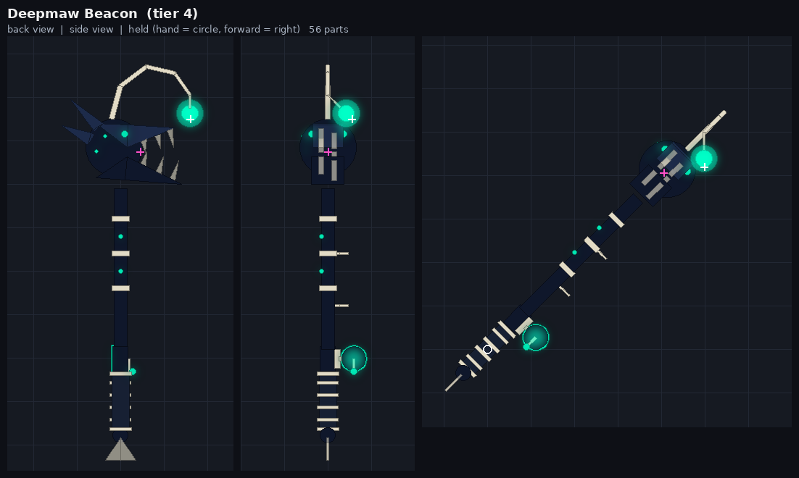

- **Id / tier:** `deepmaw_beacon` · Tier 4
- **Theme:** The open sea, the dropoff and the Abyssal mutation.
- **Story:** Whatever lives below the bell buoy lent you its lure. It will want it back.
- **Suggested perk:** +40% luck in the open sea and at the Bell Buoy dropoff; Abyssal mutation much more likely. **Price:** 900,000.
- **Hero piece:** A huge anglerfish head facing sideways: an underbite jaw full of translucent fangs, pale glowing eyes, bioluminescent spots and dorsal spines. A bone stalk arches over the mouth and dangles **a glowing lure that the fishing line comes out of**. The lure hangs plumb while held.
- **Palette:** Abyss navy `16, 24, 44` · Navy `30, 44, 74` · Bone `226, 220, 198` · **Neon abyss teal `0, 255, 200`**
- **Materials:** Slate, Marble (bone), Glass (fangs and tail fin), ForceField (lure halo), Neon, Leather (grip)
- **Detail:** Leather grip with bone wraps, a navy reel with a teal rim, two guides, a spine shaft with photophores, and a glass tail-fin pommel.
- **Effects:**
  - Idle: deep-sea `IdleMotes` drift and `IdleLureGlints` sparkle on the lure. The lure sways, **the lower jaw slowly opens and closes**, and the glow breathes slowly (0.35 Hz, ±45%). `GlowLight` is on the lure.
  - Equip: a teal burst.
  - Charge: a swirl.
  - Cast: a burst and a teal trail.
  - Bite: **the lure flares**.
  - Reel: motes, plus the flow beam.
  - Catch: **the jaw snaps** (the motion kick), followed by a teal burst, a cloud of 90 glowing plankton, a glow puff and **two teal shockwave rings** (18 studs).

## 10 · Redtide Sovereign

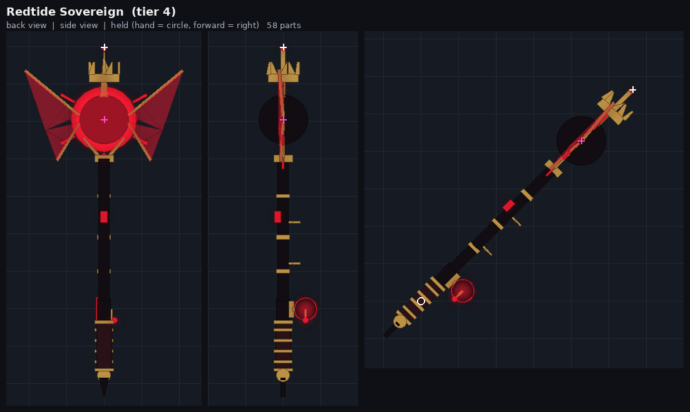

- **Id / tier:** `redtide_sovereign` · Tier 4
- **Theme:** The Blood Moon.
- **Story:** Forged on the night the tide ran red and the moon wore a crown.
- **Suggested perk:** +50% luck during a Blood Moon; Shadow mutation much more likely during a Blood Moon. **Price:** 1,500,000.
- **Hero piece:** An eclipse: a black moon in front of a blood-red corona disc, ringed by six rotating corona rays. Translucent blood-red ForceField wings with gold leading edges flap slowly on either side. Above it, **a gold crown floats and spins around a gold spire**.
- **Palette:** Black `18, 14, 18` · Tarnished gold `188, 146, 70` · **Neon blood red `255, 28, 52`**
- **Materials:** Slate, Foil (gold), ForceField (wings), Neon, Leather (grip)
- **Detail:** Leather grip with gold wraps, a black reel with a red rim, two guides, gold bands, a blood gem on the shaft, a gold collar and cradle, and a gold orb pommel with a black spike.
- **Effects:**
  - Idle: red `IdleMotes` rise from the collar around the moon and `IdlePetals` drift off it. The crown spins at 0.8 rad/s and bobs, the corona rays rotate, and the wings flap ±0.22 rad (sine, 0.6 Hz, ±45%).
  - Equip: a burst of petals.
  - Charge: a swirl.
  - Cast: a burst and a red trail.
  - Bite: a flare.
  - Reel: rising embers, plus the flow beam.
  - Catch: a burst, a 70-petal storm (`CatchPetals`), a flare, a flash and **two crimson shockwave rings** (18 studs).

---

## Installing

1. **Build the rods.** Run `RodBuilder.lua` in the Studio Command Bar. The 10 Tools appear in `ServerStorage.NewRodDrafts`; nothing else in the place is touched, and Ctrl+Z should undo it (the builder sets a ChangeHistory waypoint). If the Command Bar won't take a paste this long, put the file in a ModuleScript and run `require(thatModuleScript)` from the Command Bar.
2. **Add the effects.** Put `RodFX.lua` in a ModuleScript (for example `ReplicatedStorage.RodFX`) and drive it from your fishing LocalScript:

```lua
local RodFX = require(game.ReplicatedStorage.RodFX)
local fx -- one controller per rod Tool

tool.Equipped:Connect(function()
	fx = fx or RodFX.attach(tool, playerSettings.reducedMotion)
	fx:equip()
end)
tool.Unequipped:Connect(function()
	if fx then fx:unequip() end
end)
-- In your fishing code:
-- fx:charge(alpha)  fx:cast()  fx:bite()  fx:reel(true/false)  fx:catch("Legendary")
```

`RodFX.attach` returns a harmless do-nothing controller if it's called on the server or on a Tool with no Handle. Destroying the Tool also cleans the controller up.

## Conventions (what `RodFX` reads)

| Thing | Convention |
|---|---|
| Tool attributes | `OddtideRod=true`, `RodId`, `ArtRevision="new1"`, `Tier`, `AccentColor`, `FXPulseShape` (`sine`/`flicker`/`heartbeat`), `FXPulseSpeed` (Hz), `FXPulseDepth`, `FXCatchRings`, `FXRingSize`, `FXIdleRingPeriod` |
| Handle | A 1.2 × 0.4 stud cylinder. The rod is modelled along its length, with the reel hanging below. `Tool.Grip` leans the rod 45° forward and up (change `GRIP_TILT_DEGREES` at the top of the builder). Setting `Tool.Grip` also fills in GripPos, GripForward, GripRight and GripUp. |
| Attachments | `Tip` (where the line leaves), `Core` (hero centre: bursts and lights), plus `TrailA`/`TrailB` and `FlowStart`/`FlowEnd` |
| Effect names | Prefixes `Idle*`, `Equip*`, `Charge*`, `Cast*`, `Bite*`, `Reel*`, `Catch*`; beams named `IdleArc*` crackle; lights are named `GlowLight` and `FlashLight`. Burst emitters carry `BurstCount` (and optionally `BurstDelay`). |
| Glow parts | `FXGlow=true`, with `FXGlowPhase` (0–1) to offset each part's pulse |
| Moving parts | `FXPivot`/`FXAxis` (in Handle space), plus `FXSpin` (rad/s), `FXSwayAngle`/`FXSwaySpeed`, `FXBobDistance`/`FXBobSpeed`/`FXBobAxis`, `FXPhase`, `FXScalePulse` |
| Welds | Every part has a `WeldConstraint` named `RodWeld` to the Handle. While a rod is equipped, RodFX animates moving parts with a client-only `Weld` (`RodFXMotion`) and pauses their `RodWeld` locally, then restores it exactly afterwards. |

## How this was checked, and what wasn't

I couldn't open Studio, so I ran four checks offline:
- **Compile and type check:** both files compile with the Luau compiler, and the Luau type checker found no wrong Roblox property or enum names when checked against Roblox's current API definitions.
- **Simulated engine:** I wrote a fake Roblox engine that rejects any property, enum, attribute or method that doesn't exist in the real API dump, and does real CFrame math. Both files ran in it:
  - **Builder:** all 10 rods build at 45–59 parts. Every part is welded, unanchored, non-colliding and massless; every rod has a Tip and every effect; burst emitters start disabled; re-running replaces the folder.
  - **RodFX:** every rod ran through equip → charge → cast → bite → reel → catch → unequip → destroy, plus reduced motion and tool destruction. Animated parts stay on their orbits, the grip shake is restored even when interrupted, rings get cleaned up, and every property returns exactly to its built value afterwards.
  - **The tests themselves:** I deliberately broke RodFX and the builder four different ways, and the tests caught each one.
- **Preview renders:** the images in `previews/` were drawn from the simulated build, including a view of how each rod sits in the hand.

**Not verified** (do these in Studio):
- How the particles, Neon bloom, ForceField and Glass actually look.
- That the grip angle feels right with your hold animation.
- That WeldConstraints behave as expected on live characters.
- Whether the Command Bar accepts a 72 KB paste.

The built-in particle textures (`sparkles_main`, `smoke_main`, `fire_main`) are placeholders; uploaded textures will look better.
